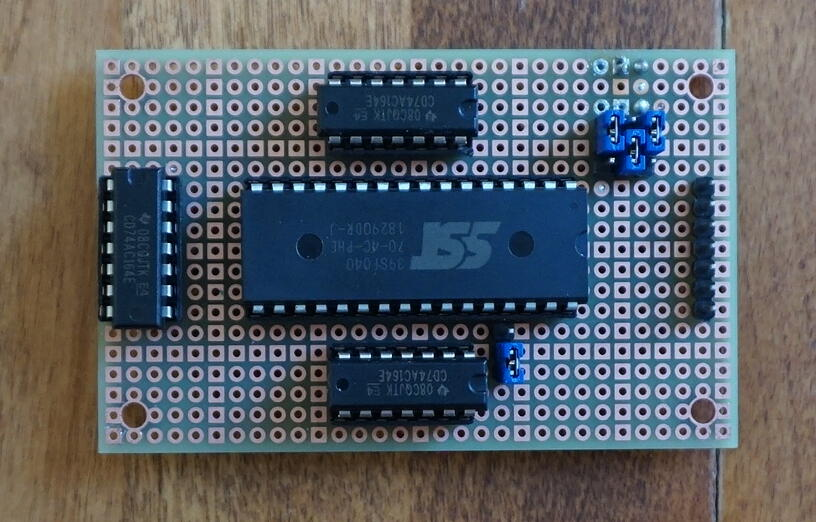

# romwrite

*Write to AT28 and SST39 memory modules through an atmega328*

This project's purpose is to be able to send data serially to at atmega328's
UART and have it drive a home-made board that writes to an AT28 or SST39 memory
module.

## AT28

The AT28 (I test with an AT28C64B) is an EEPROM module with a parallel
interface. It's expensive for what it is (5$ for 8K of memory isn't cheap), but
it has the advantage of being easily programmable and, more importantly, of
being compatible with [RC2014's ROM module][rc2014-rom]!

**PRO TIP:** If you want to use an AT28 in a RC2014 ROM module, make sure that
you set the A14 jumper high! What is A14 in the AT27 is /WE in the AT28. You
want to keep /WE high so that it stays disabled.

## SST39

The SST39 (I test with SST39SF040) is a relatively cheap 1/2/4 mbit flash module
with a parallel interface. It's not compatible with RC2014's ROM module and is
a bit tricker to program, but is cheaper than the AT28 and has higher capacity.

At this point of the project, I haven't implemented SST39 support yet, but it's
planned.

## Home-made board

So far, I've only been fiddling around so I don't have a schema. The thing,
however, is relatively simple. Here's a photo:

The header pins to the right are VCC, GND and the pins that connect to the
atmega328.

The IC socket in the middle is where the memory module goes. It's a 32 pins
socket so that we can accomodate the SST39, but we can put the AT28 in the same
socket, leaving the top 4 pins unconnected.

The three other ICs are all 74hc164 shift registers. The top one controls A0 to
A7. The bottom one, A8 to A15. The left one controls data (D0 to D7).

The three jumpers to the top select A16, A17 and A18 in case you want to write
to another page than the first one on the SST39.

The other jumper is related to AT28 compatibility and controls what is
connected to the pin just next to it. On the SST39, this pin is A14. If you
put the jumper down, it connects to the appropriate pin on the SR next to it. On
the AT28, that pin is /WE. If you put the jumper up, it connect to the pin two
positions above, that is, /WE on the SST39.

Also, what is A17 on the SST39 is VCC on the AT28. If you write to an AT28, you
need to ensure that the A17 jumper is connected to VCC.

The name I use below are the constant used in the code.

SRCP is connected to CP of both address-related SRs.

SRDS is connected to the DS of the "low" address SR and of the "data" SR. The
"high" address SR is daisy chained, so its DS is connected to the "low" SR's QH.

SRCP2 drives the "data" SR's CP.

FLWE and FLCE are connected to the main IC's /WE and /CE pins.

## Compile

To build the software, you need:

* [AVRA][avra]
* [avrdude][avrdude] to send firmware to atmega328
* GNU make

To compile and send, run `make send` if your atmega is on an arduino uno
connected through USB. If it's something else, you'll have to send your firmware
manually.

## Usage

*For now, only the AT28 is supported.*

Connect your home-made board to the atmega328 and power it on. The atmega328
is waiting for serial input. Whatever you send it will be written to the memory,
starting at offset 0.

The rate you send it data is limited and you have to limit that data rate
yourself. You won't get an error if you send it too fast, but you won't have
good data either!

The UART runs at 9600 bauds.

I've fiddled a bit and found that the maximum data rate that is reliable is 10
bytes per second. Yup, it's real real low. I'll work on this.

### Example command

I'm not very experienced with tty operations. What I found worked was to first
connect to the tty through screen, which will set things up, quit it right away,
then cat my contents to the device, rate-limiting it through [pv][pv]. Example:

    screen /dev/ttyACM0 9600
    CTRL-A + ":quit"
    cat myprog.bin | pv -L 10 > /dev/ttyACM0

### Example z80 program

If you have a stock RC2014 with a Digital I/O module, you can verify that your
stuff works with this simple ASM program:
    
	ld	A, 0x42
	out	(0), A
	halt

You can then assemble it with [scas][scas]:

    scas -o - tosend.asm | pv -L 10 > /dev/ttyACM0

On powerup (in my case, I have to hit the reset button after powerup), you'll
have your digital I/O module lighting up the light corresponding to 0x42.
    
[rc2014-rom]: https://rc2014.co.uk/modules/other-modules/8k-rom/
[avra]: http://avra.sourceforge.net/
[avrdude]: https://www.nongnu.org/avrdude/
[pv]: http://www.ivarch.com/programs/pv.shtml
[scas]: https://github.com/KnightOS/scas
